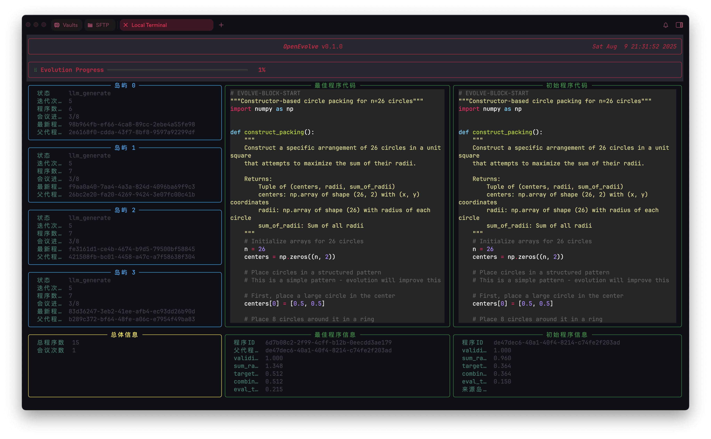
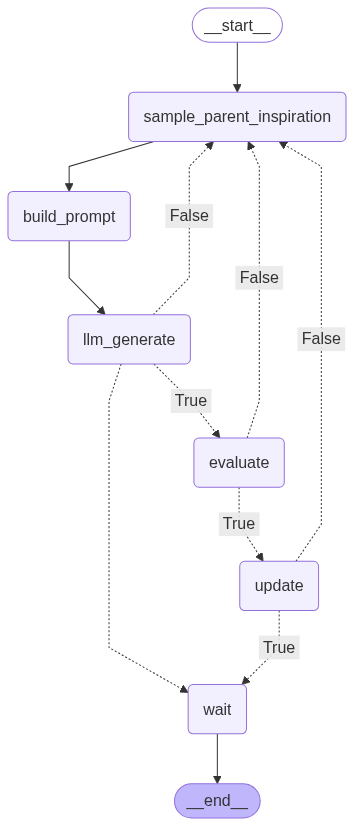
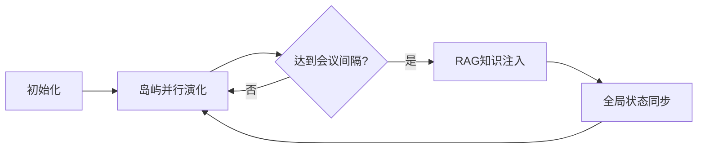

# OpenEvolve with LangGraph 🧬➡️🌐




## 🚀 核心架构

### 并行演化系统


```python
# 多岛屿并行执行示例

island_graph_list = [build_subgraph(str(i), config) for i in range(num_islands)]
futures = [run_island(subgraph_i, island_state_i) for subgraph_i, island_state_i in zip(island_graph_list, island_state_list)]
results = [f.result() for f in futures]
```

### 智能检查点系统
```python
def save_checkpoint(config, state, generation_count):
    # 保存程序状态、最佳代码和评估指标
    checkpoint_path = f"checkpoint_{generation_count}"
    os.makedirs(checkpoint_path, exist_ok=True)
    with open(f"{checkpoint_path}/state.json", "w") as f:
        f.write(state.to_json())
    # 同时保存最佳程序和配置...
```

### RAG 知识增强
```python
if config.use_rag:
    rag_node = node_rag(config)
    main_graph_state = asyncio.run(rag_node.execute(main_graph_state))
```

## 🛠️ 快速开始

### 安装依赖
```bash
pip install -r requirements.txt
```

### 配置文件示例
`configs/default.yaml`:
```yaml
evolution:
  island:
    num_islands: 4  # 并行岛屿数量
  rag:
    enabled: true
    chunk_size: 500
```

### 启动演化
```python
from workflow_withRAG import main

result = main.invoke({
    "state": GraphState(),
    "config": Config.from_yaml("configs/default.yaml")
})
```

## 📊 可视化监控


实时监控指标包括：
- 各岛屿演化进度
- RAG 检索命中率
- 最佳程序指标变化

## 🔄 工作流节点
| 节点名称                  | 功能描述                          | 代码位置              |
|--------------------------|---------------------------------|---------------------|
| `node_sample_parent_inspiration` | 选择父代程序          | Graph_Node.py       |
| `node_rag`               | 知识检索与增强               | Graph_RAG.py        |
| `meeting`                | 岛屿间知识共享               | meeting.py          |

## 🧩 模块说明

### 核心模块
- **演化引擎** `workflow_withRAG.py`
  - 主控制循环
  - 检查点管理
  - 可视化集成

- **RAG 系统** `Graph_RAG.py`
  ```python
  class node_rag(SyncNode):
      def execute(self, state):
          # 文档检索与知识增强逻辑
          return updated_state
  ```

### 数据流


## 📌 使用建议
1. 对于专业领域问题：
   ```bash
   # 将领域文档放入documents/
   cp research_paper.pdf documents/
   ```
2. 调整演化参数：
   ```yaml
   # config.yaml
   max_iterations: 500
   meeting_interval: 20
   ```

## 🐛 常见问题
**Q: 如何恢复训练？**  
```bash
python workflow_withRAG.py --checkpoint path/to/checkpoint_100
```

**Q: RAG 文档更新后需要重启吗？**  
不需要，系统会自动检测文档变更并更新索引。

---

> 💡 提示：通过 `--port` 参数可自定义可视化服务端口  
> 📊 实时监控访问 `http://localhost:8000`